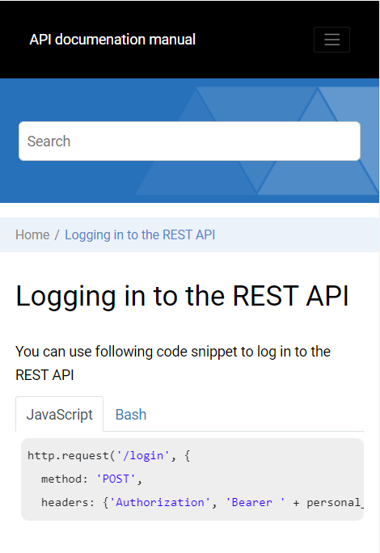

# dita-wh-tabs
DITA Open Toolkit plugin which enhances the Oxygen WebHelp responsive output to present codeblocks or DITA task steps as separate tabs.

## Installation

Install the **com.oxygenxml.codeblock-tabs** plugin in the DITA Open Toolkit: 
[https://www.dita-ot.org/dev/topics/plugins-installing.html](https://www.dita-ot.org/dev/topics/plugins-installing.html)

A sample DITA Map that contains can be found in the "samples" folder.

## Format

```
<fig outputclass="tabbed-codeblock" id="fig_1">
  <codeblock outputclass="language-javascript">http.request('/login', {
     method: 'POST',
     headers: {'Authorization', 'Bearer ' + personal_access_token}});</codeblock>
  <codeblock outputclass="language-bourne">curl -X POST -H "Authorization: Bearer $PERSONAL_ACCESS_TOKEN" \
http://oxygenxml.com/login</codeblock>
</fig>
```

## Result



## Set the parameter **tabs.for.steps** to **true** to also present DITA task steps in separate tabs.

## Copyright and License

Copyright 2022 Syncro Soft SRL.

This project is licensed under [Apache License 2.0](https://github.com/oxygenxml/dita-asciidoc/blob/master/LICENSE)
